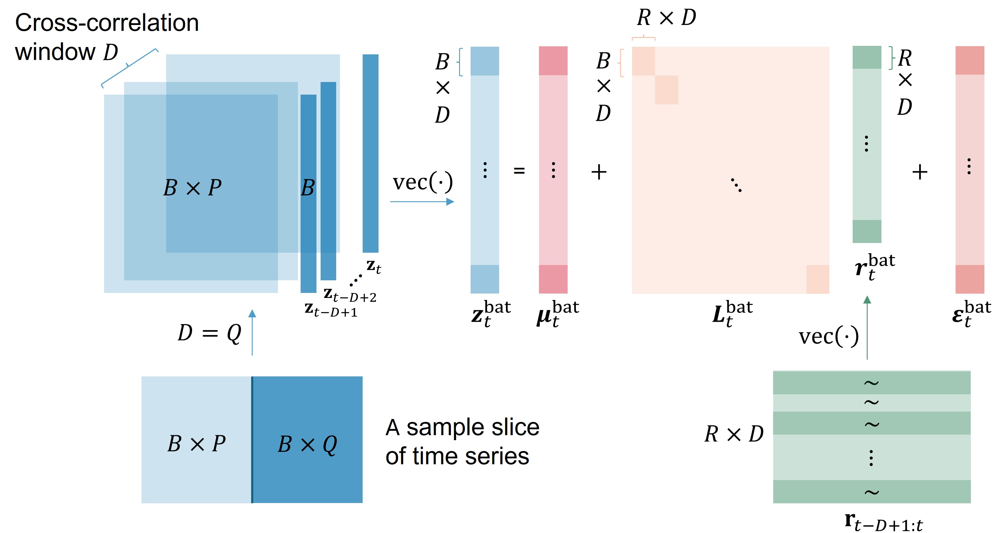

# Multivariate Probabilistic Time Series Forecasting with Correlated Errors (NeurIPS 2024)


This repository contains the PyTorch implementation for the paper
[Multivariate Probabilistic Time Series Forecasting with Correlated Errors](https://arxiv.org/pdf/2402.01000) by [Vincent Z. Zheng](https://vincent-zheng.com/) and [Lijun Sun](https://lijunsun.github.io/). This work has been accepted at NeurIPS 2024.

<p align="center">
  
</p>

## Requirements

The code requires Python 3.10 or later. The file [requirements.txt](requirements.txt) contains the full list of required Python modules. To install the dependencies, run:

```bash
pip install -r requirements.txt
```

## Training and Evaluation

### 1. Obtain the Dataset

Use the `generate_datasets.ipynb` notebook located in the `exps` directory to transform datasets from GluonTS and .h5 files into the `TimeSeriesDataSet` format used by PyTorch Forecasting.

### 2. Train the Model

To train a baseline model on the `m4_hourly` dataset, execute the following command:

```bash
python train_baseline.py --model deepar --dataset m4_hourly
```

To train the proposed model on the `m4_hourly` dataset, execute the following command:

```bash
python train_batch.py --model deepar --dataset m4_hourly --loss kernel --num_mixture_r 4
```

## Reference
```bash
@article{zheng2024multivariate,
  title={Multivariate Probabilistic Time Series Forecasting with Correlated Errors},
  author={Zheng, Vincent Zhihao and Sun, Lijun},
  journal={arXiv preprint arXiv:2402.01000},
  year={2024}
}
```
